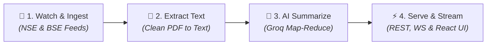

# Concall Intelligence Pipeline 🚀

An automated, real-time platform that monitors earnings call transcripts from the **National Stock Exchange (NSE)** and **Bombay Stock Exchange (BSE)**, extracts key financial data, generates grounded AI summaries, and streams them live via WebSockets and a React dashboard.

---

## 📌 Problem & Solution

### The Problem
Listed Indian companies publish quarterly earnings call transcripts (*concalls*) as 20–40+ page PDFs on NSE and BSE. These transcripts carry invaluable qualitative insights - management guidance, margin outlook, order books, and analyst Q&A - but reading them manually at scale is time-consuming and inefficient.

### The Solution
A real-time, unattended pipeline that:
1. **Watches**: Automatically detects when a concall transcript is filed on NSE/BSE.
2. **Extracts**: Parses PDF attachments into clean, readable text.
3. **Summarizes**: Runs a 2-stage AI Map-Reduce engine to produce grounded JSON + Markdown summaries without truncation or hallucination.
4. **Streams & Serves**: Emits live WebSocket events and displays real-time summaries on a modern React dashboard.

---

## 🏗️ Architecture & Pipeline Flow



### End-to-End Pipeline Stages

| Stage | Process | Description & Key Output |
| :---: | :---| :---|
| **1** | **Watch & Ingest** | Polls NSE/BSE corporate feeds for transcript disclosures and downloads raw PDFs to `data/raw/`. |
| **2** | **Extract Text** | Parses text layer, removes headers/footers/page numbers, and outputs clean text to `data/extracted/`. |
| **3** | **AI Summarize** | Runs chunk-level **MAP** extractions and adaptive **REDUCE** to produce grounded JSON + Markdown summaries in `data/summaries/`. |
| **4** | **Serve & Stream** | Stores summaries in PostgreSQL, emits live `summary.completed` WebSocket events, and updates the React dashboard. |


---

## 💻 Tech Stack

- **Frontend**: React 18, Vite, TypeScript, Tailwind CSS (White & Blue Theme), Lucide Icons
- **Backend API**: Node.js, Express, TypeScript, WebSockets (`ws`)
- **Database & ORM**: PostgreSQL 16, Drizzle ORM
- **Caching & Queues**: Redis 7, BullMQ
- **AI Engine**: Groq (`openai/gpt-oss-120b`), Axios with TPM/RPM adaptive rate-limit backoff
- **Validation**: Zod schema validation
- **Monorepo**: pnpm workspaces

---

## 🚀 How to Run the Project

### Prerequisites
- Node.js >= 18
- pnpm >= 9
- PostgreSQL & Redis

### Step 1: Install Dependencies
```bash
pnpm install
```

### Step 2: Setup Database & Seed Data
```bash
pnpm --filter @concall/backend run db:push
pnpm --filter @concall/backend run db:seed
```

### Step 3: Start Services (3 Terminal Tabs)

**Terminal 1 (PostgreSQL)**:
```powershell
pnpm db:start
```

**Terminal 2 (Redis)**:
```powershell
pnpm redis:start
```

**Terminal 3 (Backend + WebSockets + UI)**:
```powershell
pnpm dev
```

Open **`http://localhost:5173/`** (or `http://localhost:5174/`) in your browser.

---

## 🏢 Monitored Companies (5 Listed Companies across 4 Sectors)

1. **Infosys Limited** (`INFY` / BSE: `500209`) — *Information Technology*
2. **Tata Consultancy Services Limited** (`TCS` / BSE: `532540`) — *Information Technology*
3. **Sun Pharmaceutical Industries Limited** (`SUNPHARMA` / BSE: `524715`) — *Pharmaceuticals*
4. **Tata Motors Limited** (`TATAMOTORS` / BSE: `500570`) — *Automobile*
5. **HDFC Bank Limited** (`HDFCBANK` / BSE: `500180`) — *Banking & Financial Services*

---

## 📄 Real Sample Outputs (3 Companies)

- **Infosys Limited (Q1 FY25)**: [`Raw PDF`](./data/raw/INFY_Q1_FY25_Transcript.pdf) | [`Clean Text`](./data/extracted/INFY_Q1_FY25_Transcript.txt) | [`JSON Summary`](./data/summaries/INFY_Q1_FY25_Summary.json) | [`Markdown`](./data/summaries/INFY_Q1_FY25_Summary.md)
- **TCS (Q1 FY25)**: [`Raw PDF`](./data/raw/TCS_Q1_FY25_Transcript.pdf) | [`Clean Text`](./data/extracted/TCS_Q1_FY25_Transcript.txt) | [`JSON Summary`](./data/summaries/TCS_Q1_FY25_Summary.json) | [`Markdown`](./data/summaries/TCS_Q1_FY25_Summary.md)
- **Sun Pharma (Q1 FY25)**: [`Raw PDF`](./data/raw/SUNPHARMA_Q1_FY25_Transcript.pdf) | [`Clean Text`](./data/extracted/SUNPHARMA_Q1_FY25_Transcript.txt) | [`JSON Summary`](./data/summaries/SUNPHARMA_Q1_FY25_Summary.json) | [`Markdown`](./data/summaries/SUNPHARMA_Q1_FY25_Summary.md)

---

## ✨ Output Schema & Key Enhancements

The structured summary complies with and enriches the standard JSON schema:
- **`management_tone`**: Captures executive tone (e.g. *Cautiously optimistic on BFSI recovery with disciplined margin execution*).
- **Grounded `notable_qa`**: Preserves analyst names, firm names, questions, and non-fabricated management answers.
- **Strict Number Preservation**: Financial figures (₹, $, %, bps) remain exact and unedited.

```json
{
  "company": "Infosys Limited",
  "scrip_code": "500209",
  "nse_symbol": "INFY",
  "quarter": "Q1 FY25",
  "call_date": "2024-07-18",
  "source": "NSE",
  "source_url": "https://...",
  "tldr": ["Key takeaways..."],
  "management_commentary": ["Executive remarks..."],
  "management_tone": "Cautiously optimistic on BFSI demand recovery with disciplined margin execution.",
  "guidance": ["Forward looking statements..."],
  "segment_performance": [{ "segment": "Financial Services", "notes": "Grew 7.9%..." }],
  "key_metrics": [{ "metric": "Revenue", "value": "$4.7 bn", "context": "Up 3.6% QoQ" }],
  "notable_qa": [{ "asked_by": "Keith Bachman — BMO", "question": "...", "answer": "..." }],
  "risks": ["Forex volatility..."]
}
```

---

## 🧪 Verification & Testing

Run workspace verification commands:
```bash
pnpm typecheck
pnpm --recursive run test
pnpm build
```
- **Unit Tests**: 93/93 passing
- **Typecheck**: 0 errors
- **Build**: Clean production build

---

## ⚠️ Known Limitations & Future Roadmap

### Known Limitations
- **Groq Free-Tier Rate Limits**: Free API tier enforces Tokens-Per-Minute (TPM) limits (handled via adaptive exponential backoff).
- **Scanned PDFs**: Image-only scanned transcripts require an external OCR library (e.g. Tesseract).

### What I'd Do With More Time
1. **Tesseract OCR Fallback Integration**: OCR fallback for image-only scanned PDFs.
2. **Vector RAG Search**: `pgvector` integration for semantic Q&A search across historical calls.
3. **Whisper Audio Pipeline**: Automatic audio transcription when companies file audio recordings before PDF release.


