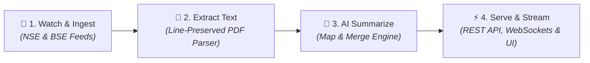

# Concall Intelligence Pipeline 🚀

An end-to-end, event-driven platform that monitors corporate filings from the **National Stock Exchange (NSE)** and **Bombay Stock Exchange (BSE)**, extracts PDF transcripts, generates grounded AI summaries via Map-Reduce, and streams real-time updates via WebSockets to a React dashboard.

---

## 📌 Architecture & How It Works



### Event-Driven Pipeline Flow
1. **Watch & Ingest**: Background watcher polls NSE & BSE APIs every minute for transcript announcements. Discovered filings are persisted as `DISCOVERED` and downloaded streamingly to `data/raw/` with SHA-256 deduplication.
2. **Extract Text**: Line-reconstructing parser (`pdfjs-dist` y-coordinate grouping) strips repeated headers/footers and page numbers. Cleaned text is saved to `data/extracted/` as `EXTRACTED`.
3. **AI Summarize**: 
   - **MAP Phase**: Extracts claims, guidance, management commentary, risks, and Q&A turns per chunk.
   - **Merge Phase**: Deterministically merges facts and stitches split Q&A turns across chunk boundaries without extra LLM round-trips.
   - **REDUCE Phase**: Generates structured JSON & Markdown summaries.
   - **Grounding Check**: Verifies numeric tokens against transcript text and records precision in `summaryJson.grounding`.
4. **Serve & Stream**: In-process EventBus notifies `ws/bridge.ts`, broadcasting `summary.completed` to connected WebSocket clients and serving REST API endpoints.

---

## 💻 Tech Stack

- **Frontend**: React 18, Vite, TypeScript, Tailwind CSS, Lucide Icons
- **Backend API**: Node.js, Express, TypeScript, WebSockets (`ws`)
- **Database & ORM**: PostgreSQL 16, Drizzle ORM
- **AI Engine**: Groq (`openai/gpt-oss-120b`), Gemini 3.6 Flash, OpenAI GPT-4o-mini
- **Validation**: Zod schema validation
- **Monorepo**: pnpm workspaces

---

## 🚀 How to Run the Project

### Prerequisites
- Node.js >= 18
- pnpm >= 9
- PostgreSQL (running on port 5432 or port 5433)

### Step 1: Install Dependencies & Build Shared Package
```bash
pnpm install
pnpm --filter @concall/shared build
```

### Step 2: Push Database Schema & Seed Companies
```bash
pnpm --filter @concall/backend run db:push
pnpm --filter @concall/backend run db:seed
```

### Step 3: Launch Full Pipeline & UI
```bash
pnpm dev
```
- **REST API**: `http://localhost:3001`
- **WebSocket Gateway**: `ws://localhost:3001/ws`
- **React UI**: `http://localhost:5173` (or `http://localhost:5174`)

---

## 🏢 Monitored Companies (5 Listed Companies across 4 Sectors)

1. **Infosys Limited** (`INFY` / BSE: `500209`) — *Information Technology*
2. **Tata Consultancy Services Limited** (`TCS` / BSE: `532540`) — *Information Technology*
3. **Sun Pharmaceutical Industries Limited** (`SUNPHARMA` / BSE: `524715`) — *Pharmaceuticals*
4. **Tata Motors Limited** (`TATAMOTORS` / BSE: `500570`) — *Automobile*
5. **HDFC Bank Limited** (`HDFCBANK` / BSE: `500180`) — *Banking & Financial Services*

---

## 📄 Real Sample Outputs (3 Companies)

- **Infosys Limited (Q1 FY25)**: [`Raw PDF`](./data/raw/INFY_Q1_FY25_Transcript.pdf) | [`Clean Text`](./data/extracted/INFY_Q1_FY25_Transcript.txt) | [`JSON Summary`](./data/summaries/INFY_Q1_FY25_Summary.json) | [`Markdown`](./data/summaries/INFY_Q1_FY25_Summary.md)
- **TCS (Q1 FY25)**: [`Raw PDF`](./data/raw/TCS_Q1_FY25_Transcript.pdf) | [`Clean Text`](./data/extracted/TCS_Q1_FY25_Transcript.txt) | [`JSON Summary`](./data/summaries/TCS_Q1_FY25_Summary.json) | [`Markdown`](./data/summaries/TCS_Q1_FY25_Summary.md)
- **Sun Pharma (Q1 FY25)**: [`Raw PDF`](./data/raw/SUNPHARMA_Q1_FY25_Transcript.pdf) | [`Clean Text`](./data/extracted/SUNPHARMA_Q1_FY25_Transcript.txt) | [`JSON Summary`](./data/summaries/SUNPHARMA_Q1_FY25_Summary.json) | [`Markdown`](./data/summaries/SUNPHARMA_Q1_FY25_Summary.md)

---

## 🧪 Verification & Testing

Run deterministic unit test suite and full workspace build:

```bash
pnpm typecheck
pnpm --filter @concall/backend run test
pnpm build
```

- **Unit Tests**: 20/20 passing (Deterministic pipeline tests, zero network/mock dependency)
- **Typecheck**: 0 errors across `@concall/shared`, `@concall/backend`, `@concall/frontend`
- **Build**: Clean production build

---

## ⚠️ Known Limitations & Future Roadmap

### Known Limitations
1. **Free-Tier Rate Limits**: Free Groq API limits (TPM/RPM) are managed with exponential backoff.
2. **Scanned PDFs**: Scanned image PDFs generate `OCR_REQUIRED` status until Tesseract OCR integration.

### Future Roadmap
1. **Tesseract OCR Integration**: Automatic OCR fallback for image-only scanned PDFs.
2. **Semantic Search (RAG)**: `pgvector` index for natural language Q&A search across historical calls.
on when companies file audio recordings before PDF release.


